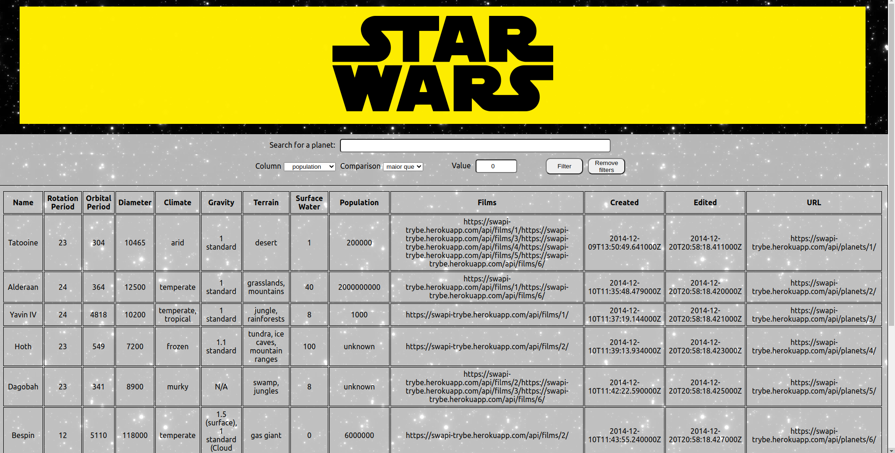

## **Bem-vindo ao repositório do projeto Starwars Planets Search!**

### Screenshots

### Contexto
No projeto Starwars Planets Search foi desenvolvido uma aplicação de listagem de planetas do universo de Starwars, com a possibilidades de filtragem escolhida pelo usuário.

### Tecnologias utilizadas
Projeto desenvolvido utilizando React, Context API e Hooks como gerenciar de estados globais da aplicação, CSS3 e React Testing Library.

### Link do Deploy
<a href="https://starwars-planets-search-project.vercel.app/">Clique aqui</a>

##### Observações:
###### Este projeto foi requisitado pela Trybe ao longo da formação do curso de Desenvolvimento Web, para avaliação do conhecimento adquirido nos módulos de Fundamentos. Todos os aquivos dentro da pasta src foram desenvolvidas por mim e os outros arquivos foram desenvolvidas pela Trybe.
